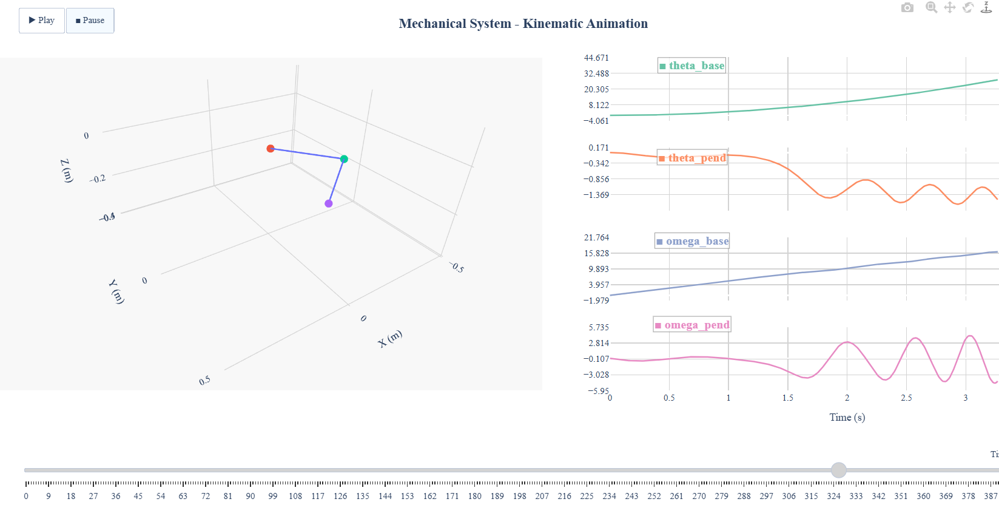

# Robotic Mechanism Simulator and Visualizer

## Overview

This repository provides a Python-based tool for simulating and **visualizing the dynamic motion of rigid body mechanisms under a specified control law**. The framework numerically solves the nonlinear dynamics of a mechanism based on the Lagrangian formulation and produces an **interactive HTML animation file** that illustrates both the physical motion (in 3D space) and the evolution of state variables over time.

This tool is designed for academic and educational purposes in the fields of **dynamics, control systems, robotics, and mechanical systems modeling**. The main idea is to provide a framework of comprehension about control laws and robotic dynamic equations.

Our tool is validates here integrating the dynamic equation of Rotary Pendulum. A complete implementation of the **Furuta Pendulum** (rotational inverted pendulum) is included, using the rigorous dynamic model derived in:
> B. S. Cazzolato and Z. Prime, "On the Dynamics of the Furuta Pendulum," *Journal of Control Science and Engineering*, vol. 2011, Article ID 528341. [https://doi.org/10.1155/2011/528341](https://doi.org/10.1155/2011/528341)


Output example [here](https://gabrielcessil.github.io/RigidBodyControl_SimuAnimator/Mechanism_Animation.html)
<p align="center">
  
</p>

---

## Purpose

This framework is developed to serve as an educational and research tool that enables:

- **Dynamic simulation** of rigid body mechanisms subject to external inputs (control laws).
- **Visualization of the resulting motion** through 3D kinematic animation synchronized with the time evolution of system states.
- A platform for validating dynamic models, studying control behavior, and illustrating complex dynamic coupling effects in mechanical systems.

It is particularly suited for applications in:

- Control system education,
- Mechanical systems analysis,
- Nonlinear dynamics demonstration,
- Development and validation of control laws.

---

## Key Features

- General-purpose dynamic solver based on the Euler-Lagrange formulation.
- Modular architecture:
  - `Mechanism`: Defines the system's dynamics and kinematics.
  - `MechanicalSystemAnimation`: Handles 3D visualization and time-series plotting.
- **Output: An interactive HTML file** containing:
  - 3D kinematic animation of the mechanism.
  - Synchronized time plots of all system states (e.g., angles, angular velocities).
- Supports both open-loop and closed-loop simulations, depending on the provided control law.
- Easily extensible to other mechanisms by defining mass, Coriolis, and gravity models.

---

## Value for Dynamics and Control Visualization

This tool provides a **visual and quantitative understanding** of how a given rigid body mechanism responds to external forces or control inputs. It serves as an intuitive complement to the mathematical formulation of dynamic systems by allowing users to:

- Observe dynamic coupling, energy exchanges, and nonlinear effects.
- Validate dynamic models through visual inspection and time-based diagnostics.
- Test and refine control strategies by visually examining system behavior.

---
## Using the `Mechanism` Class

### Class Description

The `Mechanism` class is an abstract base class that represents the general structure of any rigid body mechanism. It provides the necessary methods to solve the equations of motion of a system defined in the Euler-Lagrange formulation.

### Methods to Implement in a Subclass

To define a specific mechanism (e.g., the Rotary Pendulum), the user must inherit from `Mechanism` and implement the following methods:

- **`M(q)`**: Returns the mass (inertia) matrix of the system, a function of the generalized coordinates `q`.

- **`C(q, q_dot)`**: Returns the Coriolis and centrifugal matrix, dependent on the generalized coordinates `q` and their time derivatives `q_dot`.

- **`G(q)`**: Returns the gravity vector, representing gravitational forces as a function of `q`.

- **`direct_kinematics(state)`**: Computes the 3D positions of key points in the mechanism for visualization, given the current state (positions and velocities).
## Usage Example:  Furuta Pendulum Simulation

### Model Description

The Furuta Pendulum is a classical underactuated system composed of:

- A horizontal base arm actuated by a torque (`theta_base`).
- A pendulum arm attached to the end of the base, free to rotate in the vertical plane (`theta_pend`).

This simulation accurately represents the nonlinear coupled dynamics, including full inertia tensors, centripetal, Coriolis, viscous damping, and gravitational forces, following the derivations from Cazzolato and Prime (2011).

### Model Implementation
```python
class Rotary_Pendulum(Mechanism):

    def __init__(self, params, origin=[0,0,0]):
        self.params = params
        self.origin = origin

    # Calculate positions in 3D space given a state
    def direct_kinematics(self, state):
        theta_base, theta_pen = state[0], -state[1]

        L1, L2 = self.params["L1"], self.params["L2"]
        x0, y0, z0 = self.origin

        # Posição do braço base
        x1 = L1 * np.cos(theta_base)
        y1 = L1 * np.sin(theta_base)
        z1 = 0

        # Posição do pêndulo
        x2 = x1 + L2 * np.sin(theta_base) * np.sin(theta_pen)
        y2 = y1 - L2 * np.cos(theta_base) * np.sin(theta_pen)
        z2 = - L2 * np.cos(theta_pen)

        return (x0, y0, z0), (x1, y1, z1), (x2, y2, z2)

    # Auxiliary methods
    # Get mass matrix
    def M(self, q):
      # Read parameters
      J1, J2 = self.params['J1'], self.params['J2']
      m1, m2 = self.params['m1'], self.params['m2']
      l1, l2 = self.params['l1'], self.params['l2']
      L1, L2 = self.params['L1'], self.params['L2']
      # Calculate composed parameters
      J1_ = J1+m1*l1**2
      J0_ = J1_+m2*L1**2
      J2_ = J2 +m2*l2**2
      # Calculate mass matrix elements
      M11 = J0_ + J2_*np.sin(q[1])**2
      M12 = m2*L1*l2*np.cos(q[1])
      M21 = m2*L1*l2*np.cos(q[1])
      M22 = J2_
      return np.array([[M11, M12],[M21, M22]])

    # Get centrifugal matrix
    def C(self, q, q_dot):
      # Read parameters
      J1, J2 = self.params['J1'], self.params['J2']
      m1, m2 = self.params['m1'], self.params['m2']
      l1, l2 = self.params['l1'], self.params['l2']
      L1, L2 = self.params['L1'], self.params['L2']
      b1, b2 = self.params['b1'], self.params['b2']
      # Calculate composed parameters
      J2_ = J2 +m2*l2**2
      # Calculate centrifugal parameters elements
      C11 = b1 + 0.5*q_dot[1]*J2_*np.sin(2*q[1])
      C12 = 0.5*q_dot[1]*J2_*np.sin(2*q[1])-m2*L1*l2*np.sin(q[1])*q_dot[1]
      C21 = -0.5*q_dot[0]*J2_*np.sin(2*q[1])
      C22 = b2
      return np.array([[C11,C12],[C21,C22]])

    # Get gravity matrix
    def G(self, q, g=9.81):
      # Get parameters
      m1, m2 = self.params['m1'],self.params['m2']
      L1, L2 = self.params['L1'],self.params['L2']
      # Calculate matrix elements
      G1, G2 = 0, g*m2*L2*np.sin(q[1])
      return np.array([G1,G2])
```

### Final Code Example
Once the mechanism is defined, we can use a control law (in this example a open loop step) and integrate the dynamic equation of motion. The following example replicates the one found in the referenced article in order to validate the integration.

```python
from rotary_pendulum import Rotary_Pendulum
from mechanism_animation import MechanicalSystemAnimation
import numpy as np

# Define system parameters (per Cazzolato & Prime, 2011)
params = {
    "m1": 0.300,
    "m2": 0.075,
    "L1": 0.278,
    "L2": 0.300,
    "l1": 0.150,
    "l2": 0.148,
    "J1": 2.48e-2,
    "J2": 3.86e-3,
    "b1": 1e-4,
    "b2": 2.8e-4
}


# Usage of the mechanism class by the Rotaty Pendulum
pendulum = Rotary_Pendulum(params)

# Initial states compatible to the mechanism class
initial_state = {
    "theta_base": 0,
    "theta_pend": 0,
    "omega_base": 0,
    "omega_pend": 0
}

# Open loop control law
def control_law(t, q):
    return np.array([0.2, 0])

# Mechanism integration
pendulum.solve_system(control_law, x0=initial_state, tf=4, steps=400)

animator = MechanicalSystemAnimation(pendulum)
animator.create_animation()
```

## Limitations

This code is a practical tool to visualize the robotic equations of motion and it's control. However, numerical tools as Matlab/Simulink provide a more robust simulation for final implementations. Use this tool for didactic or initial project steps. 
